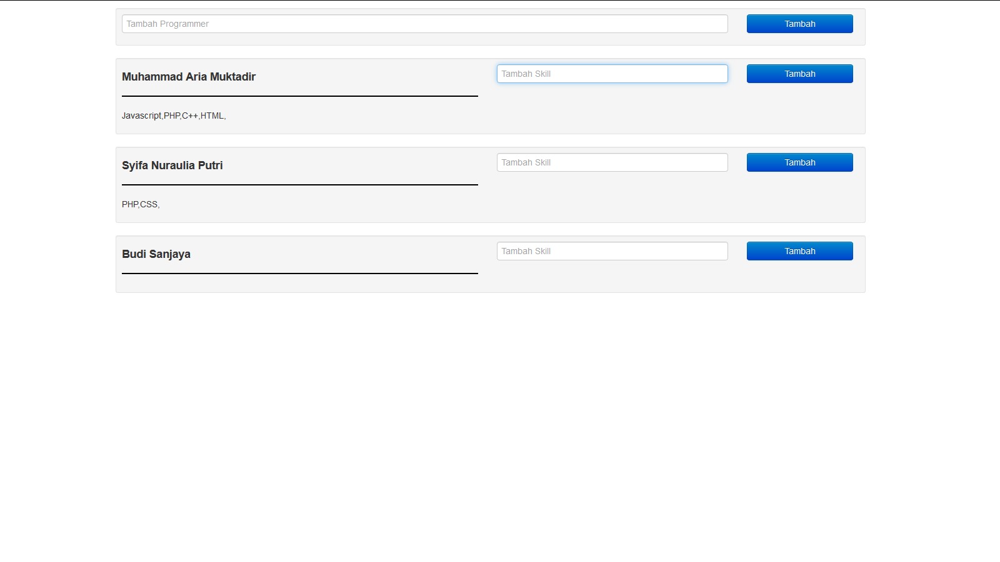

# arkademy_test_aria

# Soal 1 :
Rest Api Adalah jembatan komunikasi data melalui HTTP umumnya digunakan dalam aplikasi WEB
Manfaat JSON, JSON sendiri kepanjangan dari Javascript Object Notations adalah sebuah format untuk membagi data dalam bahasa Javascript. Format ini hampir bisa dibaca oleh semua bahasa, Format ini juga telah mengalahkan XML
dan kegunaan JSON pada REST API ialah sebagai output dari hasil request, Bisa berformat Text, Object, Array dan lain lain, tetapi biasanya berformat OBject

# Soal 2
<h3>Screenshoot Program</h3>

  

<h3>Stack yang digunakan dalam Soal 6</h3>
<ul>
  <li>Mysql / Mariadb</li>
  <li>Composer</li>
  <li>PHP 7.3</li>
  <li>Laravel</li>
  <li>Axios</li>
  <li>Vue JS</li>
  <li>Bootstrap Twitter</li>
</ul>

<h3>Cara Penggunaan Aplikasi Soal 6</h3>
<ul>
  <li>Import File ke Mysql yang ada di dalam folder '6' nama filenya 'db-dump.sql'</li>
  <li>jalankan di cmd / terminal # cd 6</li>
  <li>Pastikan telah terinstall composer</li>
  <li>jalankan di cmd / terminal # composer install</li>
  <li>jalankan di cmd / terminal # php -S localhost:8000 -t public</li>
  <li>dan buka di browser http://localhost:8000 </li>
  <li>Selamat Melakukan Proses Penilaian</li>
</ul>
